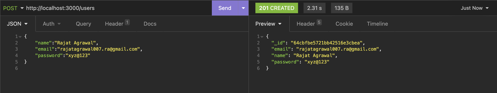
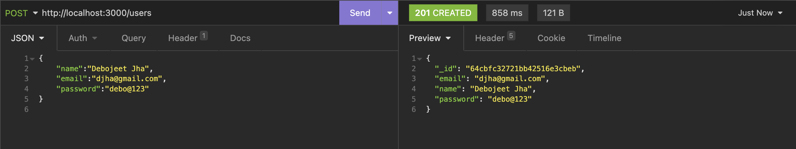
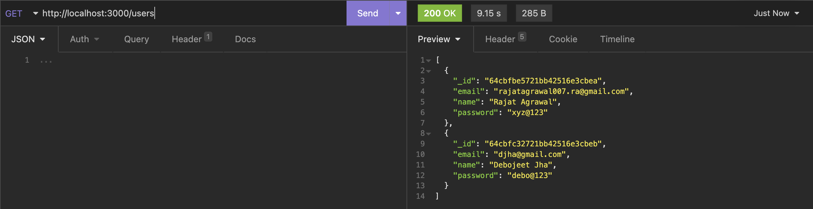
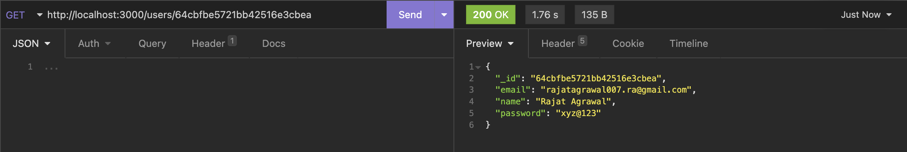
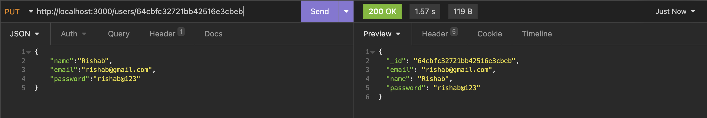
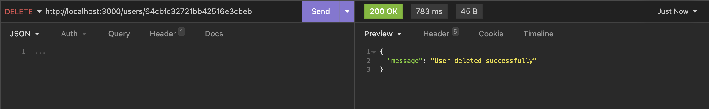

# Flask API with MongoDB

This is a simple Flask application that provides a REST API for performing CRUD (Create, Read, Update, Delete) operations on a User resource using MongoDB as the database.

## Requirements

- Flask==2.3.2
- pymongo==4.4.1
- python-dotenv==1.0.0
- schema==0.7.5
- certifi==2023.7.22

## Setup

1. Clone the repository:
    ```
    git clone https://github.com/rjt007/flask_crud_api.git
    ```
2. Go to the folder:
    ```
    cd flask_crud_api
    ```
3. Create a virtual environment and activate it:
    ```
    python -m venv venv
    ```
    ```
    Linux/Mac: source venv/bin/activate 
    Windows: venv\Scripts\activate
    ```
4. Install the required dependencies:
    ```
    pip install -r requirements.txt
    ```

5.  Set up MongoDB:
    - Create a MongoDB Atlas cluster or use a local MongoDB server.

6. Create a **.env** file and set:
    ```
    DATABASE_URI = your mongoDB connection string
    ```

7. Run the Flask application:
    ```
    python server.py

    or

    flask --app server.py run
    ```

## REST API Endpoints

### Get All Users

- **URL**: `/users`
- **Method**: `GET`
- **Response**: JSON array of all users

### Get User by ID

- **URL**: `/users/<id>`
- **Method**: `GET`
- **Response**: JSON object representing the user with the specified ID

### Create a New User

- **URL**: `/users`
- **Method**: `POST`
- **Request Body**: JSON object with user data (name, email, password)
- **Response**: JSON object representing the newly created user with assigned ID

### Update User by ID

- **URL**: `/users/<id>`
- **Method**: `PUT`
- **Request Body**: JSON object with updated user data (name, email, password)
- **Response**: JSON object representing the updated user

### Delete User by ID

- **URL**: `/users/<id>`
- **Method**: `DELETE`
- **Response**: JSON object with a message indicating successful deletion or "User not found" if the user does not exist

## Usage

You can use tools like Postman, Insomnia or REST Client to test the API endpoints:

### Examples and Screenshots

1. POST `/users`

    
    

2. GET `/users`
    

3. GET `/users/id`
    

4. PUT `/users/id`
    

5. DELETE `/users/id`
    

## Conclusion
That's it! We have successfully created Flask API with MongoDB for managing users. Happy coding!
